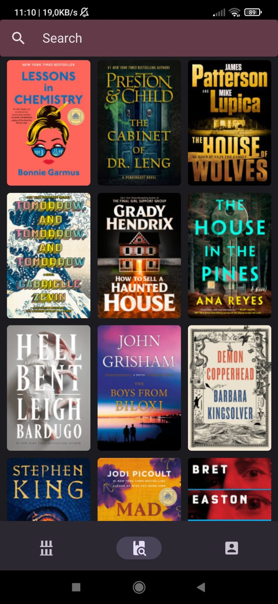
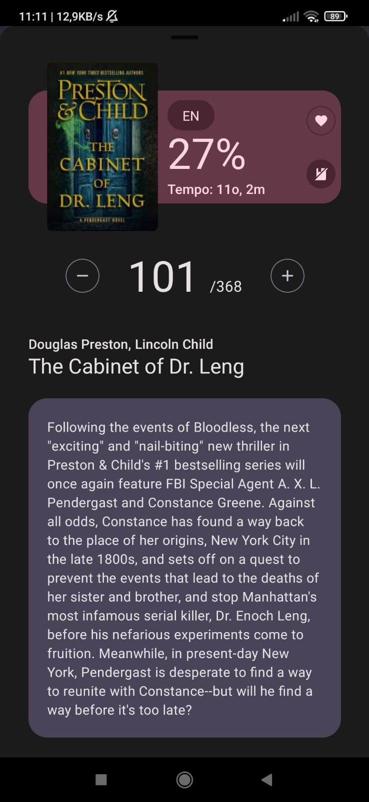
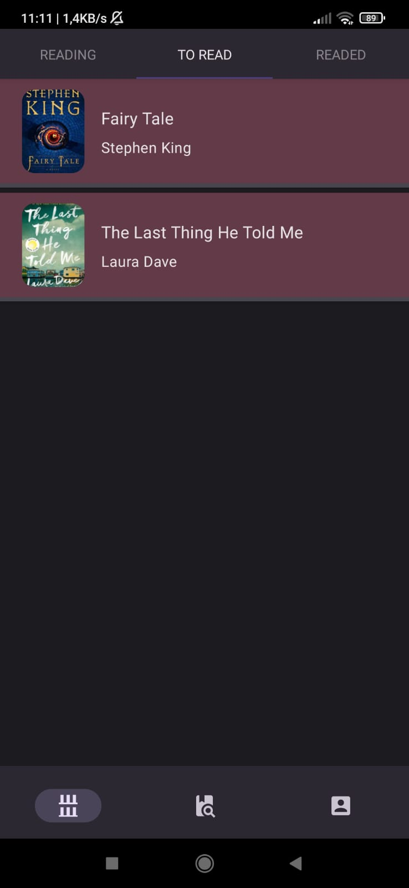
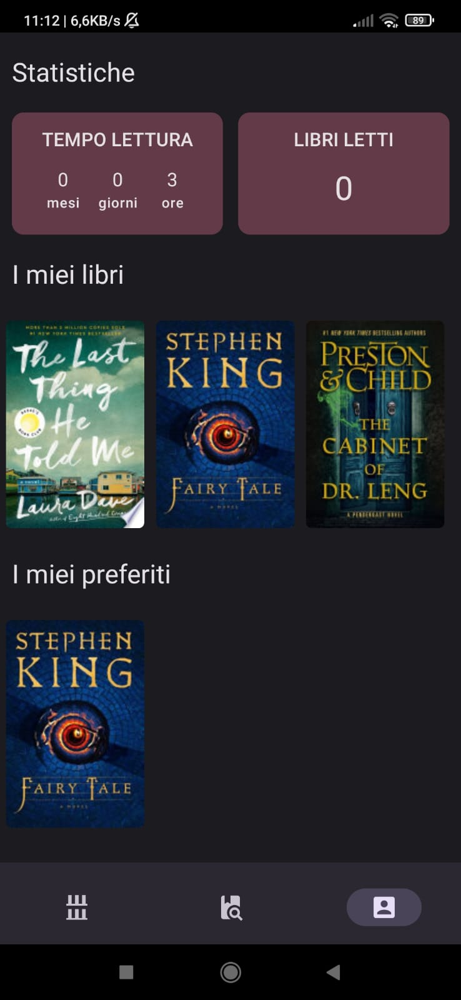

# Nova Lectio - Books Tracking App

An Android app for tracking books made with React Native.

## Features

- Up-to-date best seller list from the New York Times API
- Book search functionality powered by Google Books API
- Total reading time tracker for an overview of your reading progress

## Supported Languages

The app currently only supports Italian.

## Screenshots

## Download

Get the app from our [releases page](https://github.com/GiudaBallerino/nova-lectio/releases).
